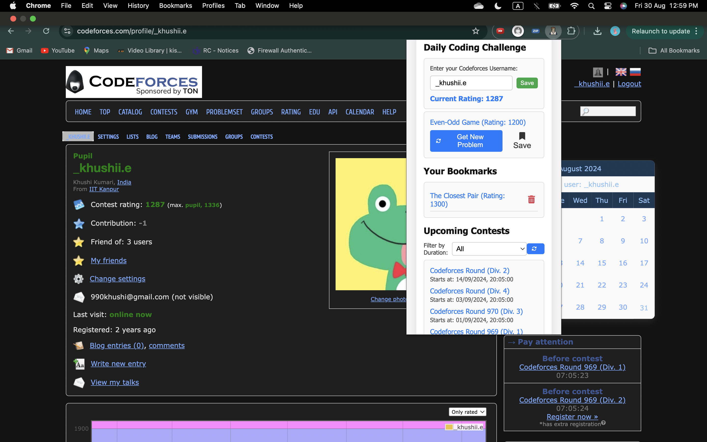
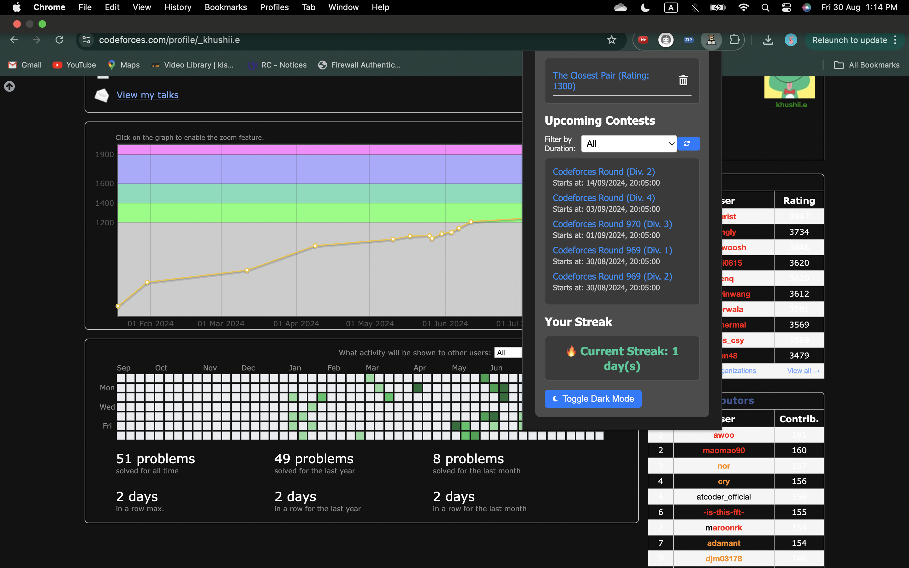

# DailyCode-Buddy

Your daily coding companion delivering challenges, contest updates, and personalized problem-solving streaks.

## Installation

1. Clone or download the repository.
2. Go to `chrome://extensions/` in Chrome.
3. Enable Developer mode.
4. Click "Load unpacked" and select the extension folder.

## Usage

- **Save Username**: Enter and save your username.
- **Fetch Problem**: Click "New Problem" to get a problem based on your rating.
- **Bookmark**: Save problems by clicking "Bookmark."
- **View Contests**: Refresh and filter upcoming contests.
- **Track Streak**: Your streak updates automatically.
- **Toggle Dark Mode**: Click the dark mode button to switch themes.

## Screenshots

